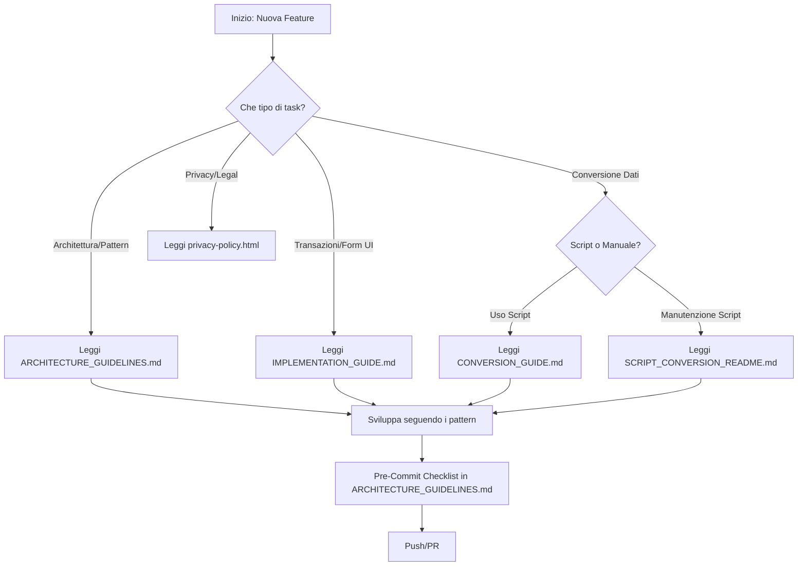

# AntCashManager - Documentazione Centrale

Benvenuto nella documentazione tecnica di **AntCashManager**. Questa pagina è il **punto di partenza** per navigare tutta la documentazione del progetto.

> 👋 **Primo accesso?** Leggi [GUIDA_LETTURA.md](./GUIDA_LETTURA.md) - guida strutturata per il tuo profilo  
> ⚡ **Hai fretta?** Leggi [QUICK_START.md](./QUICK_START.md) - 5 minuti per iniziare  
> 🗺️ **Preferisci una mappa visuale?** Leggi [NAVIGATION.md](./NAVIGATION.md) per una guida di navigazione con griglie per ruolo e ricerca per argomento.

---

## 📋 Indice Principale

### ⚡ **Accesso Rapido (5 minuti)**
Per chi ha fretta: inizia da [QUICK_START.md](./QUICK_START.md) e scegli il tuo percorso.

### 🗺️ **Navigazione per Ruolo**
Per una guida strutturata per il tuo profilo: consulta [NAVIGATION.md](./NAVIGATION.md).

---

### 🏗️ **Architettura e Sviluppo**
Tutto ciò di cui hai bisogno per sviluppare nuove feature seguendo i principi di Clean Architecture.

| Documento | Scopo | Destinatari | Accedi |
|-----------|-------|-------------|--------|
| **ARCHITECTURE_GUIDELINES.md** | Definisce pattern UseCase/ViewModel/State/Screen, layer boundaries, testing, logging e anti-pattern. Fonte ufficiale per decisioni architetturali. | Sviluppatori, Tech Lead | [📖 Leggi](./ARCHITECTURE_GUIDELINES.md) |

### 📚 **Guide Implementative**
Documentazione di specifiche milestone o feature implementate.

| Documento | Scopo | Quando Usarlo | Accedi |
|-----------|-------|---------------|--------|
| **IMPLEMENTATION_GUIDE.md** | Dettagli implementazione di skeleton loading, form transazioni esteso (note, payee, location, tags, ricorrenza). Storico decision-making per quella milestone. | Quando modifichi UI transazioni o skeleton loading | [📖 Leggi](./IMPLEMENTATION_GUIDE.md) |

### 🔄 **Data Conversion & Migration**
Guide e script per conversione dati PiggyBank Pro → AntCashManager (formato debug).

| Documento | Scopo | Quando Usarlo | Accedi |
|-----------|-------|---------------|--------|
| **CONVERSION_GUIDE.md** | Flusso rapido conversione dati, mapping campi, prerequisiti. Guida esecutiva per chi usa lo script. | Quando devi convertire dati PiggyBank Pro (quick start) | [📖 Leggi](./CONVERSION_GUIDE.md) |
| **SCRIPT_CONVERSION_README.md** | Dettagli tecnici script Python: schema input/output, validazioni, esempi log, codici errore. Fonte per manutenzione/estensione. | Quando devi mantenere o estendere il script Python | [📖 Leggi](./SCRIPT_CONVERSION_README.md) |

### 🔐 **Privacy & Policy**
Documentazione legale e informative sulla privacy.

| Documento | Lingue | Scopo | Accedi |
|-----------|--------|-------|--------|
| **privacy-policy.html** | 🇬🇧 Inglese | Policy privacy ufficiale con focus usage-only analytics | [📄 Leggi](./privacy-policy.html) |
| **privacy-policy-de.html** | 🇩🇪 Tedesco | Versione localizzata privacy policy | [📄 Leggi](./privacy-policy-de.html) |
| **privacy-policy-es.html** | 🇪🇸 Spagnolo | Versione localizzata privacy policy | [📄 Leggi](./privacy-policy-es.html) |
| **privacy-policy-fr.html** | 🇫🇷 Francese | Versione localizzata privacy policy | [📄 Leggi](./privacy-policy-fr.html) |

---

## 🎯 Guida Rapida per Ruoli

### 👨‍💻 **Sviluppatore: Prima Feature**
1. Leggi [ARCHITECTURE_GUIDELINES.md](./ARCHITECTURE_GUIDELINES.md) - parti da "Clean Architecture"
2. Consulta gli esempi di Screen/ViewModel nella stessa guida
3. Verifica i test examples per coprire i tuoi test
4. **Fatto!** Sei pronto a sviluppare seguendo i pattern

### 🔨 **Sviluppatore: Modifiche Transazioni**
1. Consulta [IMPLEMENTATION_GUIDE.md](./IMPLEMENTATION_GUIDE.md) - storico decisioni UI
2. Verifica flusso dati e layout pattern già implementati
3. Applica lo stesso pattern per nuovi campi
4. Testa seguendo la checklist nel documento

### 🗄️ **DevOps/Backend: Conversione Dati**
1. Per uso rapido: [CONVERSION_GUIDE.md](./CONVERSION_GUIDE.md)
2. Per manutenzione script: [SCRIPT_CONVERSION_README.md](./SCRIPT_CONVERSION_README.md)
3. Script ufficiale: `scripts/convert_to_debug_data.py`

### 📋 **Tech Lead/Architect: Review Architettura**
1. Fonte ufficiale: [ARCHITECTURE_GUIDELINES.md](./ARCHITECTURE_GUIDELINES.md)
2. Verifica gli "Aggiornamenti Critici" all'inizio del documento
3. Usa la checklist "Pre-Commit" per PR review
4. Aggiorna il documento se cambi i pattern

### ⚖️ **Legal/Compliance: Privacy Policy**
1. Policy ufficiale: [privacy-policy.html](./privacy-policy.html)
2. Localizzazioni: DE, ES, FR disponibili
3. Evento standard Firebase consentito: `screen_view`
4. Analytics custom: solo utilizzo app, no dati personali

---

## 📊 Metadati Progetto

| Campo | Valore |
|-------|--------|
| **App Name** | AntCashManager |
| **Versione Corrente** | 1.4.6 |
| **Package Name** (`applicationId`) | `com.sformica.ant_cashmanager` |
| **Namespace Android** | `com.antcashmanager.android` |
| **Moduli Principali** | `androidApp`, `shared` (KMP) |
| **Tech Stack** | Jetpack Compose, Kotlin Multiplatform, Room, Koin |

---

## 🔄 Flusso di Lavoro Consigliato

---

## 📝 Note di Manutenzione Wiki

**Quando aggiornare la documentazione:**

| Evento | Azione | File da aggiornare |
|--------|--------|-------------------|
| Cambi pattern architetturali | Aggiorna prima ARCHITECTURE_GUIDELINES.md | ARCHITECTURE_GUIDELINES.md |
| Modifica script conversione | Aggiorna entrambi i doc di conversione | CONVERSION_GUIDE.md + SCRIPT_CONVERSION_README.md |
| Nuova feature UI | Se storica, aggiungi sezione a IMPLEMENTATION_GUIDE.md | IMPLEMENTATION_GUIDE.md |
| Aggiorna versione app | Aggiorna version number ovunque | Tutti i doc rilevanti |
| Nuova localizzazione | Aggiungi file privacy-policy-XX.html | privacy-policy-XX.html |

---

## 🔗 Link Rapidi

### Dentro il Progetto
- 📂 Wiki: `/opt/src/GIT/app/AntCashManager/wiki/`
- 🔧 Script: `/opt/src/GIT/app/AntCashManager/scripts/convert_to_debug_data.py`
- 📱 Android App: `/opt/src/GIT/app/AntCashManager/androidApp/`
- 📦 Shared (KMP): `/opt/src/GIT/app/AntCashManager/shared/`

### Esterno
- GitHub: `https://github.com/sformica/AntCashManager`
- Privacy Policy (Web): `/wiki/privacy-policy.html`

---

## ❓ FAQ Rapida

**P: Per quale file iniziare?**  
R: Dipende dal ruolo (vedi "Guida Rapida per Ruoli" sopra). Per sviluppo nuovo: ARCHITECTURE_GUIDELINES.md.

**P: Dove sono gli esempi di codice?**  
R: In ARCHITECTURE_GUIDELINES.md e IMPLEMENTATION_GUIDE.md. Vedi anche il codice esistente:
- Screen: `androidApp/src/main/kotlin/.../ui/screen/`
- ViewModel: `androidApp/src/main/kotlin/.../ui/screen/[feature]/`

**P: Come gestisco custom exception nel domain?**  
R: ARCHITECTURE_GUIDELINES.md → "UseCase & Result Pattern" → "Custom Domain Exceptions"

**P: Dove sono i test example?**  
R: ARCHITECTURE_GUIDELINES.md → "Testing Requirements"

**P: Come converto dati da PiggyBank?**  
R: CONVERSION_GUIDE.md per uso rapido, SCRIPT_CONVERSION_README.md per dettagli tecnici.

---

## 🚀 Prossimi Passi

1. **Nuovo qui?** Seleziona il tuo ruolo nella "Guida Rapida per Ruoli" sopra
2. **Leggi il documento primario** per il tuo task
3. **Consulta gli esempi** nel documento
4. **Verifica la Pre-Commit Checklist** prima di commit
5. **Aggiorna la wiki** se scopri qualcosa di nuovo

---

**Ultimo Aggiornamento**: Maggio 2026  
**Versione Wiki**: 1.0 con Index centralizzato  
**Maintainer**: Team AntCashManager

